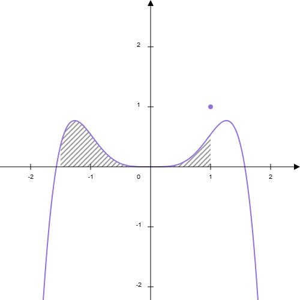

<h1 align="center">jPlot</h1>

<h2 align="center">Dynamic Math Graphs Ploting in JavaScript.</h2>

<div align="center">
    
</div>

<div align="center">
    <a href="https://github.com/EduardoJM/jplot"></a>
    <a href="https://github.com/EduardoJM/jplot"></a>
    <a href="https://www.npmjs.com/package/jplot"></a>
</div>

This is a (in development) dynamic math graph ploting library. This project, and package, contains, for now, some Rendering Items, like the **Axis**, **Function**, **Point** and the **AreaUnderCurve** with some **LineStyle's** and some **FillStyle's** utilities.

## Install

```bash
npm install jplot --save
```

## Usage

TODO: write the usage in the future. For now, see the `example/index.ts`.

## Build

### 1 - Clone the repository and install dependencies

```bash
git clone https://github.com/EduardoJM/jplot.git
cd jplot
npm install
```

### 2 - Build the browser example

```bash
npm run ex
```

And, now, open the `demo/index.html` and the demo is here.

### 3 - Build the package version

```bash
npm run build
```

## References

### HTML5 Canvas

- [The HTML5 Canvas Handbook](http://bucephalus.org/text/CanvasHandbook/CanvasHandbook.html)
- [CanvasRenderingContext2D - Web APIs | MDN](https://developer.mozilla.org/en-US/docs/Web/API/CanvasRenderingContext2D)

### Colors

- [HTML Color Names](https://www.w3schools.com/colors/colors_names.asp)
